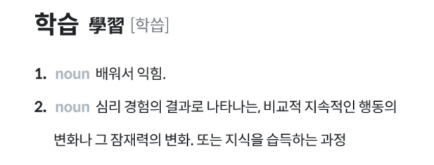

### [문제 01-01] 다음을 마크업 하여라.


```HTML
<!-- 마크업 연습 헤딩 태그와 패러그래프 태그-->
<h1>구름EDU 클라우드 SW교육환경</h1>
<p>
  스크래치3, 엔트리부터 파이썬, C언어까지 설치가 전혀 필요없고강력한 LMS와
  연동된 SW교육환경이 눈앞에 펼쳐집니다.누구나 SW에 대한 지식과 경험을 나눌
  수 있고, 누구나 SW를 배울 수 있는 환경! 지금 경험해보세요!
</p>

```

### [문제 01-02] 다음을 마크업 하여라.


```HTML
<!-- 마크업 연습 헤딩 태그와 패러그래프 태그-->
<h1>황제펭귄</h1>
<h2>생물학적 특성</h2>
<p>
  지구상에 생존하는 모든 펭귄들 중에서 가장 키가 크고 체중이 많이 나가는
  종이다. 서식지는 남극과 포클랜드 제도이다. 암컷과 수컷은 덩치와 깃털
  무늬가 비슷하며, 성체는 최고 122센티미터에 몸무게는 22~37킬로그램까지
  나간다. 등은 검고 가슴 부위는 창백한 노랑색을 띠고 있으며 귀 부위는 밝은
  노랑색이다. 다른 펭귄들과 마찬가지로 황제펭귄은 날지 못한다. 이들은 해양
  생활에 적합한 유선형의 몸매와 플리퍼(flipper)로 불리는 납작한 날개를 갖고
  있다.
</p>
<h2>특성</h2>
<p>
  황제펭귄은 남극의 겨울 기간 동안 알을 낳는 유일한 종으로, 50 ~ 120킬로미터
  정도 얼음 위를 걸어 새끼들을 키우는 군집장소까지 이동한다. 이 군집장소에는
  최대 수천 마리의 개체들이 모인다. 성체 황제펭귄들은 노래를 통해 짝짓기를
  하고, 암컷은 한 개의 알을 낳는다. 수컷은 암컷이 바다로 돌아가서 먹이를
  충분히 먹고 돌아올 때까지 태양이 완전히 뜨지 않아 최대 -60℃까지 기온이
  떨어지는 1개월을 포함하여 약 4개월간 알을 발등에 올려놓고 품는다. 이
  기간동안 수컷은 수분정도만 섭취하며 버틴다. 알이 부화하면 수컷은 4개월간
  위 속에 간직했던 물고기를 한 번 새끼에게 준다. 암컷이 돌아오면 수컷이 역할
  교대를 하여 바다로 먹이를 섭취하러 나가며, 암컷이 새끼를 돌본다. 새끼가
  성장하여 천적인 도둑갈매기로부터 안전해지면 한 곳에 모아 집단으로
  관리한다. 펭귄의 새끼는 다른 조류와 마찬가지로 솜털로 덮여있는데, 성체가
  되면 솜털이 빠지고 깃털이 나면서 수영에 적합한 상태가 된다. 황제펭귄의
  수명은 야생에서 보통 20년 정도이지만, 기록에 따르면 일부 개체들은 50년까지
  살 수 있다고 한다.
</p>
```

### [문제 01-03] 다음을 마크업 하여라.


```HTML
<!-- 마크업 연습 -->
<p>
  가끔 눈물을 흘린다. 눈물을 참을 수 없는 나 자신이 싫은 순간도 있다. 아픈
  마음을 달래기 위해, 소리치며 울 수 있다는 건 좋은 거야. 그렇지? 눈물은
  슬픔을 위한 것만은 아니니까.
  <br />
  <br />
  난 눈물이 좋다.<br />
  아니, **머리가 아닌 <strong>마음으로 우는 내가 좋다.</strong>**
</p>
```

### [문제 01-04] 다음을 마크업 하여라.


```HTML
  <!-- 시맨틱 마크업 -->
  <strong>Be Really Excellent</strong>
  <h1>구름EDU 클라우드 SW교육환경</h1>
  <h3>
    스크래치3, 엔트리부터 파이썬, C언어까지 설치가 전혀 필요없고 강력한 LMS와
    연동된 SW교육환경이 눈앞에 펼쳐집니다. 누구나 SW에 대한 지식과 경험을 나눌
    수 있고, 누구나 SW를 배울 수 있는 환경! 지금 경험해보세요!
  </h3>

    <a href="https://edu.goorm.io">서비스 바로가기</a>
```

### [문제 01-05] 다음을 마크업 하여라.


```HTML
<!-- a태그로 감싸서 링크를 연결할 수 있음.-->
<a href="https://www.youtube.com/c/kimbug" target="_blank">
  <h1>Subscribe Kimbug</h1>
  <p>
    김버그는 여러분의 사랑과 관심을 항상 갈구합니다.<br />
    이 카드를 클릭하시면 버그의 유튜브 채널로 이동합니다.
  </p>
</a>
```

### [문제 01-06] a태그의 여러가지 사용방법

```HTML
<!-- a태그의 여러가지 사용 방법-->
<a href="https://edu.goorm.io">구름</a>
<a href="./about.html">상대경로</a>
<a href="#hello">페이지내 이동</a>
<a href="mailto:메일주소">메일쓰기</a>
<a href="tel:전화번호">전화걸기</a>
```

### [문제 01-07] 다음을 마크업 하여라.


```HTML

```

### [문제 01-08] 다음을 마크업 하여라.


```HTML
<!-- 이미지 태스는 src, alt 속성을 같이 사용해야 함.-->

```

### [문제 01-09] 다음을 마크업 하여라.


```HTML
<h1>개발 분야</h1>
<ul style="list-style-type: none;">
  <!-- 순서가 중요하지 않은 리스트다. 브라우저에게 알려줌-->
  <li>웹 개발자</li>
  <li>서버 개발자</li>
  <li>프론트엔드 개발자</li>
  <li>자바 개발자</li>
  <li>안드로이드 개발자</li>
  <li>iOS개발자</li>
  <li>파이썬 개발자</li>
  <li>시스템,네트워크 관리자</li>
</ul>
```

### [문제 01-10] 다음을 마크업 하여라.


```HTML
<h1>급상승 검색어</h1>
<ol>
  <li><a href="">김버그</a></li>
  <li><a href="">프론트엔드 개발</a></li>
  <li><a href="">프론트엔드 개발</a></li>
  <li><a href="">구름</a></li>
  <li><a href="">주니어개발자</a></li>
  <li><a href="">Goorm</a></li>
  <li><a href="">Frontend</a></li>
  <li><a href="">개발</a></li>
  <li><a href="">구름IDE</a></li>
  <li><a href="">버그 킴</a></li>
  <li><a href="">튕김버그</a></li>
</ol>
```

### [문제 01-11] 다음을 마크업 하여라.


```HTML
<dl>
  <dt><dfn>학습</dfn></dt>
  <dd>
    배워서 익히는 일, 교육학에서는, 지식의 획득, 인식의 발전, 습관의 형성
    등을 목표로 하는 의식적 행동을 가리킴
  </dd>
  <dd>
    심리적 행동적 경험을 쌓음으로써 행동의 양태가 변화 발전하는 일
  </dd>
</dl>
```

### [문제 01-12] 다음을 마크업 하여라.



```HTML
<dl>
  <dt><dfn>학습</dfn></dt>
  <dd>
    배워서 익히는 일, 교육학에서는, 지식의 획득, 인식의 발전, 습관의 형성
    등을 목표로 하는 의식적 행동을 가리킴
  </dd>
  <dd>
    심리적 행동적 경험을 쌓음으로써 행동의 양태가 변화 발전하는 일
  </dd>
</dl>
```
