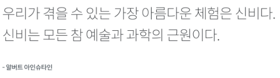
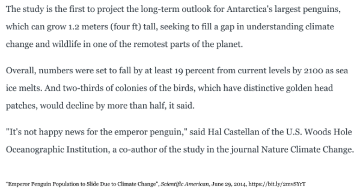
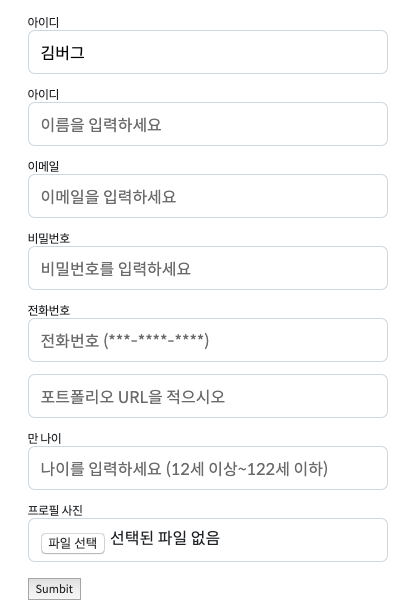
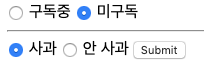
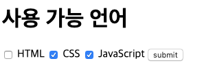
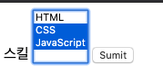
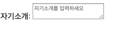

### [문제 01-01] 다음을 마크업 하여라.



- 인용 Quotations
- blockquote, q
- 문단이나 내용 전체가 인용문일때 blockquote 사용 q보다 많이 사용
- cite: 출처

```html
<blockquote cite="https://edu.goorm.io">
  우리가 겪을 수 있는 가장 아름다움 체험은 신비다.
  <br />
  신비는 모든 참 예술과 과학의 근원이다.
  <cite>알버트 아인슈타인</cite>
</blockquote>
```

### [문제 01-02] 다음을 마크업 하여라.



```html
<!-- q태그는 따옴표가 생긴다. -->
<blouote cite="https://bit.ly/2mvSYrT">
  <p>
    The study is the first to project the long-term outlook for Antarctica's
    largest penguins, which can grow 1.2 meters (four ft) tall, seeking to fill
    a gap in understanding climate change and wildlife in one of the remotest
    parts of the planet.
  </p>
  <p>
    Overall, numbers were set to fall by at least 19 percent from current levels
    by 2100 as sea ice melts. And two-thirds of colonies of the birds, which
    have distinctive golden head patches, would decline by more than half, it
    said.
  </p>
  <p>
    <q>It's not happy news for the emperor penguin,</q> said Hal Castellan of
    the U.S. Woods Hole Oceanographic Institution, a co-author of the study in
    the journal Nature Climate Change.
  </p>
  <cite>
    “Emperor Penguin Population to Slide Due to Climate Change”, Scientific
    American, June 29, 2014, https://bit.ly/2mvSYrT
  </cite>
</blouote>
```

### [문제 01-03] 다음을 마크업 하여라.



```html
<form action="" method="GET">
  <label for="user-name">아이디</label>
  <input
    type="text"
    id="user-name"
    placeholder="아이디를 입력하세요"
    minlength="5"
    maxlength="13"
    required
    value="김버그"
  />
  <!--value: 일종의 초기값-->
  <label for="user-id">아이디</label>
  <input
    type="text"
    id="user-id"
    placeholder="이름을 입력하세요"
    disabled
  /><!--disabled: 사용할수없게 막아둔다.-->

  <label for="user-email">이메일</label>
  <input type="email" id="user-email" placeholder="이메일을 입력하세요" />
  <label for="user-password">비밀번호</label>
  <input
    type="password"
    id="user-password"
    placeholder="비밀번호를 입력하세요"
    minlength="6"
  />
  <label for="user-tel">전화번호</label>
  <input
    type="tel"
    id="user-tel"
    placeholder="전화번호 (***-****-****)"
    pattern="[0-9]{3}-[0-9]{4}-[0-9]{4}"
  />
  <input type="url" placeholder="포트폴리오 URL을 적으시오" />

  <label for="user-age">만 나이</label>
  <input
    type="number"
    id="user-age"
    placeholder="나이를 입력하세요 (12세 이상~122세 이하)"
    min="12"
    max="122"
  />

  <label for="user-profile-picture">프로필 사진</label>
  <input type="file" id="user-profile-picture" accept=".png,.jpg" />
  <button>
    Sumbit
  </button>
</form>
```

### [문제 01-04] 다음을 마크업 하여라.



```html
<form action="" method="GET">
  <input type="radio" name="subscription" id="subscribed" value="subscribed" />
  <label for="subscribed">구독중</label>
  <input
    type="radio"
    name="subscription"
    id="unsubscribed"
    value="unsubscribed"
  />
  <label for="unsubscribed">미구독</label>

  <hr />

  <input type="radio" name="apple" value="1" id="apple" />
  <label for="apple">사과</label>
  <input type="radio" name="apple" value="0" id="unapple" />
  <label for="unapple">안 사과</label>
  <button type="submit">Submit</button>
</form>
```

### [문제 01-05] 다음을 마크업 하여라.



```html
<h1>사용 가능 언어</h1>
<form>
  <input type="checkbox" name="skills" value="html" id="html" />
  <label for="html">HTML</label>
  <input type="checkbox" name="skills" value="css" id="css" />
  <label for="css">CSS</label>
  <input type="checkbox" name="skills" value="js" id="js" />
  <label for="js">JavaScript</label>
  <button type="submit">submit</button>
</form>
```

### [문제 01-06] 다음을 마크업 하여라.



```html
<form action="" method="GET">
  <label for="skill">스킬</label>
  <select multiple name="skill" id="skill">
    <option value="html">HTML</option>
    <option value="css">CSS</option>
    <option value="js">JavaScript</option>
  </select>
  <button>Sumit</button>
</form>
```

### [문제 01-07] 다음을 마크업 하여라.



```html
<!-- rows, cols는 css로 변경가능하기 때문에 안넣어 줘도 됨.-->
<label for="field">자기소개:</label>
<textarea id="field" placeholder="자기소개를 입력하세요" required></textarea
><!-- disabled로 사용가능-->
```
