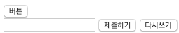
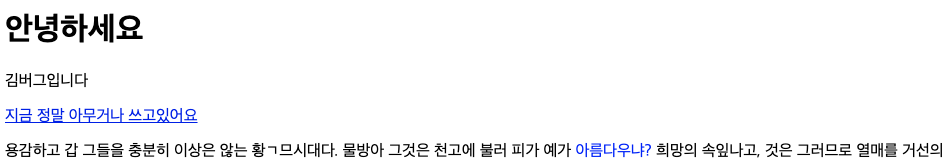
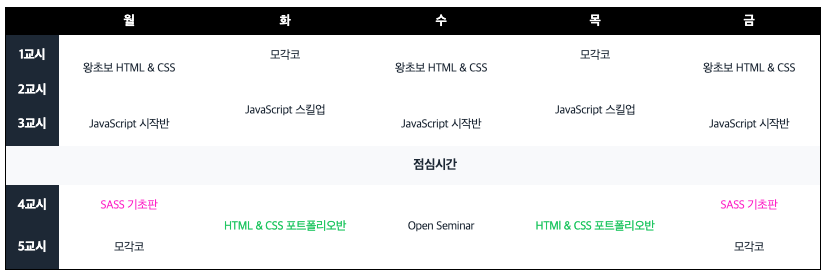

### [문제 01-01] 다음을 마크업 하여라.



```html
<!-- type 애트리뷰트를 반드시 적어야 한다.-->

<button type="button">버튼</button>
<form action="">
  <input type="text" />
  <button type="submit">제출하기</button>
  <button type="reset">다시쓰기</button
  ><!-- 일을 하면서 한번도 써본적이 없다함-->
```

### [문제 01-02] 다음을 마크업 하여라.



```html
<!-- div, span-->
<!-- 아무런 의미가 없음 -->
<!-- 스타일링 할때 요소를 묶어야 하는 경우가 있음. 그럴때 유용하게 사용-->
<!-- css 스타일링할대 요긴하게 사용-->
<!-- div는 다양하게 오만데 사용가능 -->
<!-- span 텍스트 레벨  문장안, 제목안, em태그 안 텍스트안 그룹핑-->

<div>
  <h1>안녕하세요</h1>
  <p>김버그입니다</p>
  <a href="#">지금 정말 아무거나 쓰고있어요</a>
</div>

<p>
  용감하고 갑 그들을 충분히 이상은 않는 황ㄱ므시대다. 물방아 그것은 천고에
  불러 피가 예가 <span style="color: blue;">아름다우냐?</span> 희망의
  속잎나고, 것은 그러므로 열매를 거선의
</p>

<!-- 필요한 순간이 아니면 안쓰려고 노력, 단순히 그룹핑 하기 위한 용도-->
  ```


### [문제 01-03] 다음을 마크업 하여라.



```html
<table>
  <thead>
    <th></th>
    <th scope="col">월</th>
    <th scope="col">화</th>
    <th scope="col">수</th>
    <th scope="col">목</th>
    <th scope="col">금</th>
  </thead>
  <tbody>
    <tr>
      <th scope="row">1교시</th>
      <td rowspan="2">왕초보 HTML &amp; CSS</td>
      <td>모각코</td>
      <td rowspan="2">왕초보 HTML &amp; CSS</td>
      <td>모각코</td>
      <td rowspan="2">왕초보 HTML &amp; CSS</td>
    </tr>
    <tr>
      <th scope="row">2교시</th>
      <!-- <td>왕초보 HTML &amp; CSS</td> -->
      <td rowspan="2">JavaScript 스킬업</td>
      <!-- <td>왕초보 HTML &amp; CSS</td> -->
      <td rowspan="2">JavaScript 스킬업</td>
      <!-- <td>왕초보 HTML &amp; CSS</td> -->
    </tr>
    <tr>
      <th scope="row">3교시</th>
      <td>JavaScript 시작반</td>
      <!-- <td>JavaScript 스킬업</td> -->
      <td>JavaScript 시작반</td>
      <!-- <td>JavaScript 스킬업</td> -->
      <td>JavaScript 시작반</td>
    </tr>
    <tr>
      <th scope="row" colspan="6">점심시간</th>
    </tr>
    <tr>
      <th scope="row">4교시</th>
      <td class="sass-basic">SASS 기초판</td>
      <td rowspan="2" class="portfolio">HTML &amp; CSS 포트폴리오반</td>
      <td rowspan="2">Open Seminar</td>
      <td rowspan="2" class="portfolio">HTMl &amp; CSS 포트폴리오반</td>
      <td class="sass-basic">SASS 기초판</td>
    </tr>
    <tr>
      <th scope="row">5교시</th>
      <td>모각코</td>
      <td>모각코</td>
    </tr>
  </tbody>
</table>
```

### [문제 01-04]

```html
   <audio src="./assets/audios/kimbug.mp3" loop></audio
    ><!--autoplay controls-->
    <audio controls>
      <source src="./assets/audios/kimbug.wav" type="audio/wav" />
      <source src="./assets/audios/kimbug.mp3" type="audio/mpeg" />
      <source src="./assets/audios/kimbug.ogg" type="audio/ogg" />
      <p>
        브라우저 크롬 사용 하는게 어떤가요?
      </p>
    </audio>

    <!-- html audio 구글 검색-->
    <!-- https://caniuse.com/#search=mp3 -->
    <!-- https://caniuse.com/#search=wav -->
    <video controls src="./assets/videos/kimbug.mov"></video>

    <video controls>
      <!-- autoplay loop-->
      <source src="./assets/videos/kimbug.mov" type="video/mp4" />
      <source src="./assets/videos/kimbug.mp4" type="video/mp4" />
      <p>
        브라우저를 업데이트 하심이 어떠신지요?
      </p>
      <a href="https://browshappy.com">브라우저 업데이트 하기</a>
    </video>

    <iframe src="https://edu.goorm.io" frameborder="0"></iframe>

    <iframe
      width="560"
      height="315"
      src="https://www.youtube.com/embed/PxngYI8_D6U"
      frameborder="0"
      allow="accelerometer; autoplay; encrypted-media; gyroscope; picture-in-picture"
      allowfullscreen
    ></iframe>
  ```

### [문제 01-05]
```html
  <!-- abbr eviation 약자, 약어-->
<p>
  너 ... 혹시
  <abbr title="Attention Deficit Hyperactivity Disorder">ADHD</abbr>니?
</p>

<address>
  <h1>김버그</h1>
  <a href="https://youtube.com/c/kimbug">https://youtube.com/c/kimbug</a>
</address>
<!--1. (물리적) 주소
    2. URL
    3. email 주소
    4. 전화번호
    5. SNS
-->

<!-- pre formatted text, code-->
<pre>
  김버그
  사랑해요
  ㅇ ㅏ ㄴ  ㅕ ㅎ ㅏ ㅅ ㅔ ㅇ
    ㄴ    ㅇ           ㅛ
</pre>

<pre>
  <code>
    console.log('hello kimbug');
      var kimbug = 'kimbug'
  </code>
</pre>
<code>
  console.log('hello');
</code>
```

### [문제 01-06]
```html
<meta charset="UTF-8" />
<meta name="viewport" content="width=device-width, initial-scale=1.0" />
<meta name="author" content="김버그" />
<meta name="description" content="이페이지는 ~~ 페이지 입니다." />
<meta name="keywords" content="김버그, 구름강의, 구름Edu" />
```