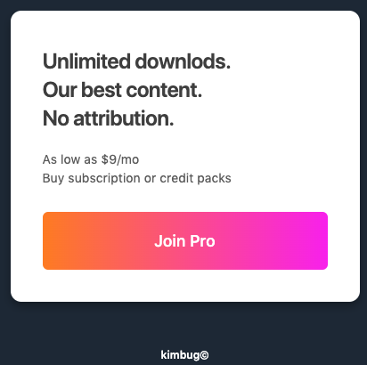
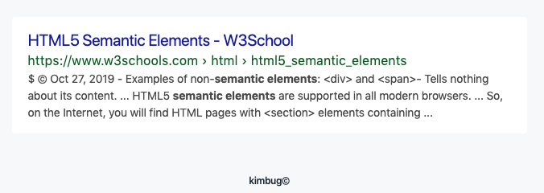
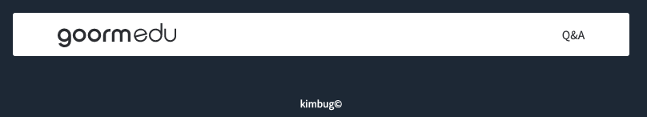
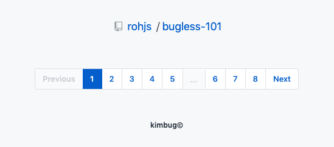

### [문제 01-01] 다음을 마크업 하여라.



```html
<div class="modal">
  <h1>
    Unlimited downlods.<br />
    Our best content.<br />
    No attribution.
  </h1>

  <p>
    As low as $9/mo<br />
    Buy subscription or credit packs
  </p>
  <a href="#" target="_blank">Join Pro</a>
</div>
```

### [문제 01-02] 다음을 마크업 하여라.



```html
<div class="modal">
  <h1>
    Unlimited downlods.<br />
    Our best content.<br />
    No attribution.
  </h1>

  <p>
    As low as $9/mo<br />
    Buy subscription or credit packs
  </p>
  <a href="#" target="_blank">Join Pro</a>
</div>
```

### [문제 01-03] 다음을 마크업 하여라.


```html
<div class="feature-box no-image">
  <!-- alt 값을 비워둔다. 정보자체가 크게 의미가 없을 때 -->
  <h1>Free unlimited private repositories</h1>
  <p>
    Free for small teams under 5 and priced to scale with Standard
    ($3/user/mo) or Premium ($6/user/mo) plans.
  </p>
</div>
```

### [문제 01-04] 다음을 마크업 하여라.


```html
<div class="header">
  <h1>
    <a href="./02-04.html">
      </a>
  </h1>

  <a href="https://edu.goorm.io/qna">Q&amp;A</a>
</div>
```

### [문제 01-05] 다음을 마크업 하여라.


```html
<div class="breadcrumb">
  <a href="" aria-label="Go to rohjs profile page">rohjs</a>
  <a href="" aria-label="Go to bugless-101 repository page">bugless-101</a>
</div>
<!-- WAI-ARIA  웹 접근성-->
<div class="pagination">
  <a href="" aria-label="Go to previous page" class="disabled ">Previous</a>
  <ol>
    <li class="current-page">
      <a href="#" aria-label="Current page. Go to page 1">1</a>
    </li>
    <li><a href="#" aria-label="Go to page 2">2</a></li>
    <li><a href="#" aria-label="Go to page 3">3</a></li>
    <li><a href="#" aria-label="Go to page 4">4</a></li>
    <li><a href="#" aria-label="Go to page 5">5</a></li>
    <li><button type="button" disabled>...</button></li>
    <li><a href="#" aria-label="Go to page 6">6</a></li>
    <li><a href="#" aria-label="Go to page 7">7</a></li>
    <li><a href="#" aria-label="Go to page 8">8</a></li>
  </ol>
  <a href="" aria-label="Go to next page">Next</a>
</div>
```