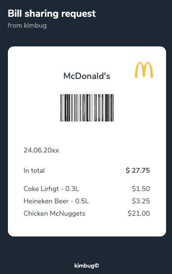
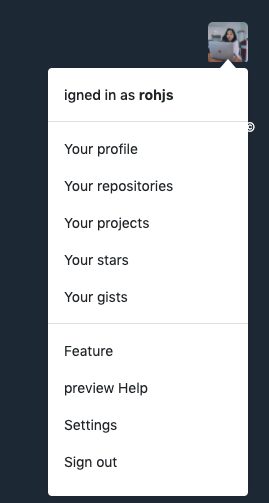
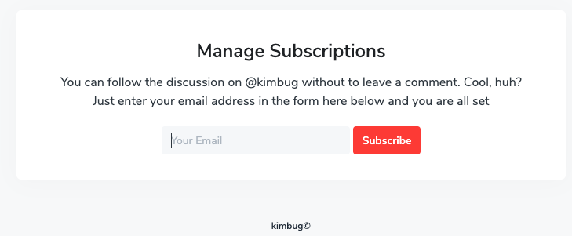
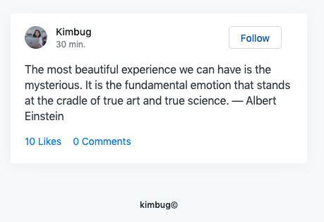
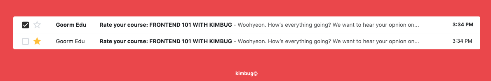
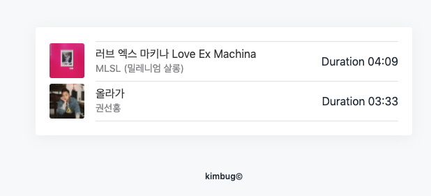
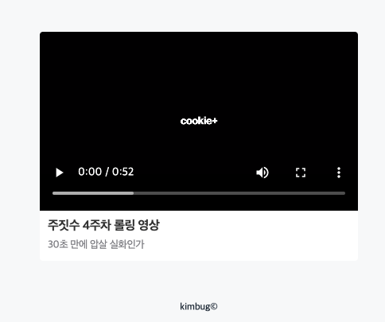

### [문제 01-01] 다음을 마크업 하여라.


```html

```

### [문제 01-02] 다음을 마크업 하여라.


```html

```

### [문제 01-03] 다음을 마크업 하여라.



```html

```

### [문제 01-04] 다음을 마크업 하여라.



```html

```

### [문제 01-05] 다음을 마크업 하여라.



```html

```

### [문제 01-06] 다음을 마크업 하여라.



```html

```

### [문제 01-07] 다음을 마크업 하여라.



```javascript
```

### [문제 01-08] 다음을 마크업 하여라.



```html
<ol class="music-player">
  <li class="music-play-item">
    
    <div class="music-play-info">
      <div class="music-palu-info-detail">
        <h1>
          <span lang="ko">러브 엑스 마키나</span>
          Love Ex Machina
        </h1>
        <strong>MLSL (밀레니엄 살롱)</strong>
      </div>
       <span>
        <span>Duration</span>04:09
      <span>
    </div>
    <audio class="music-audio" src="./assets/music-1.mp3"></audio>
  </li>
</ol>
```

### [문제 01-09] 다음을 마크업 하여라.



```html
<div class="video-palyer">
  <div class="video-player-container">
    <video controls>
      <source src="" type="" />
      <source src="" type="" />
    </video>
  </div>
  <div class="video-player-info">
    <h1>주짓수 4주차 롤링 영상</h1>
    <p>30초 만에 압살 실화인가</p>
  </div>
</div>
```
