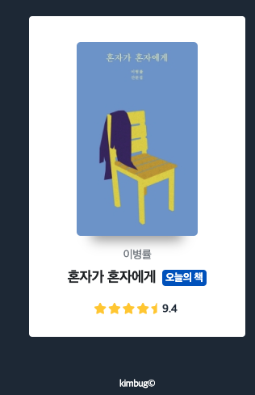
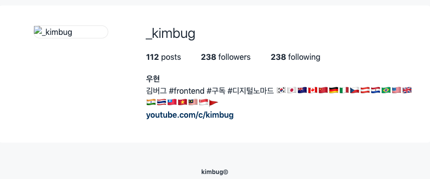

### [문제 01-01] 다음을 마크업 하여라.


```html
<div class="product-card">
  <div class="product-card-image">
    
  </div>

  <div class="product-card-title">
    <h1>혼자가 혼자에게</h1>
    <strong aria-label="오늘의 책 선정">오늘의 책</strong>
  </div>

  <strong aria-label="저자 이병률" class="product-card-author"
    >이병률</strong
  >
  <strong aria-label="평점 9.4" class="product-card-review">
    <span aria-hidden="true"
      ><!-- 스크린리더로 읽지 않는다.-->
      <i class="fas fa-star"></i>
      <i class="fas fa-star"></i>
      <i class="fas fa-star"></i>
      <i class="fas fa-star"></i>
      <i class="fas fa-star-half"></i>
    </span>

    9.4
  </strong>
</div>
```

### [문제 01-02] 다음을 마크업 하여라.


```html
<div class="user-profile">
  <div class="user-profile-data">
    <h1>_kimbug</h1>

    <dl>
      <div>
        <dt>Posts</dt>
        <dd>112</dd>
      </div>
      <div>
        <dt>Followers</dt>
        <dd>238</dd>
      </div>
      <div>
        <dt>Following</dt>
        <dd>238</dd>
      </div>
    </dl>

    <h2>우현</h2>
    <p>
      김버그 #frontend #구독 #디지털노마드
      🇰🇷🇯🇵🇳🇿🇨🇦🇨🇳🇩🇪🇮🇹🇨🇿🇦🇹🇵🇾🇧🇷🇺🇸🇬🇧🇮🇳🇹🇭🇹🇼🇻🇳🇲🇾🇸🇬🚩
    </p>
    <a href="https://www.youtube.com/c/kimbug">youtube.com/c/kimbug</a>
  </div>
  <div class="user-profile-photo">
    
  </div>
</div>
```