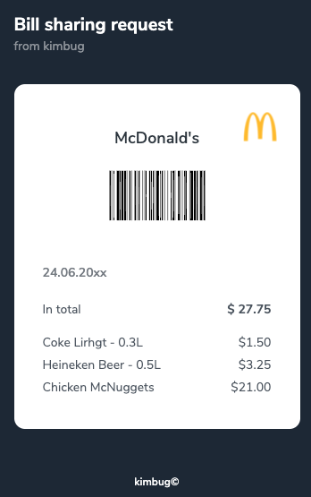
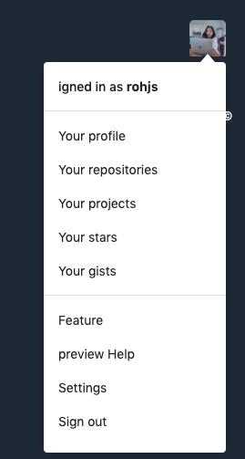
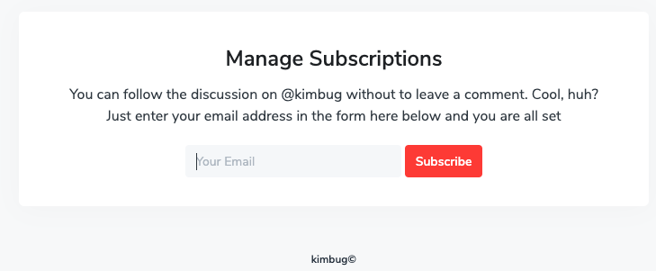
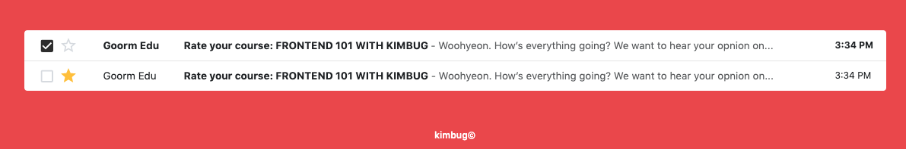

### [문제 01-01] 다음을 마크업 하여라.


```html
<div class="product-card">
  <div class="product-card-image">
    
  </div>

  <div class="product-card-title">
    <h1>혼자가 혼자에게</h1>
    <strong aria-label="오늘의 책 선정">오늘의 책</strong>
  </div>

  <strong aria-label="저자 이병률" class="product-card-author">이병률</strong>
  <strong aria-label="평점 9.4" class="product-card-review">
    <span aria-hidden="true"
      ><!-- 스크린리더로 읽지 않는다.-->
      <i class="fas fa-star"></i>
      <i class="fas fa-star"></i>
      <i class="fas fa-star"></i>
      <i class="fas fa-star"></i>
      <i class="fas fa-star-half"></i>
    </span>

    9.4
  </strong>
</div>
```

### [문제 01-02] 다음을 마크업 하여라.


```html
<div class="user-profile">
  <div class="user-profile-data">
    <h1>_kimbug</h1>

    <dl>
      <div>
        <dt>Posts</dt>
        <dd>112</dd>
      </div>
      <div>
        <dt>Followers</dt>
        <dd>238</dd>
      </div>
      <div>
        <dt>Following</dt>
        <dd>238</dd>
      </div>
    </dl>

    <h2>우현</h2>
    <p>
      김버그 #frontend #구독 #디지털노마드
      🇰🇷🇯🇵🇳🇿🇨🇦🇨🇳🇩🇪🇮🇹🇨🇿🇦🇹🇵🇾🇧🇷🇺🇸🇬🇧🇮🇳🇹🇭🇹🇼🇻🇳🇲🇾🇸🇬🚩
    </p>
    <a href="https://www.youtube.com/c/kimbug">youtube.com/c/kimbug</a>
  </div>
  <div class="user-profile-photo">
    
  </div>
</div>
```

### [문제 01-03] 다음을 마크업 하여라.



```html
<h1>
  Bill sharing request
  <span>from kimbug</span>
</h1>

<div class="receipt">
  <h2>McDonald's</h2>
  <strong class="barcode">
    
  </strong>
  <span aria-label="Issued on June 24, 20xx">
    24.06.20xx
  </span>

  <div>
    <dl>
      <div>
        <dt>Coke Lirhgt - 0.3<span aria-label="litter">L</span></dt>
        <dd>
          &dollar;1.50
        </dd>
      </div>

      <div>
        <dt>Heineken Beer - 0.5<span aria-label="litter">L</span></dt>
        <dd>
          &dollar;3.25
        </dd>
      </div>
      <div>
        <dt>Chicken McNuggets</dt>
        <dd>
          &dollar;21.00
        </dd>
      </div>
    </dl>
    <dl>
      <dt>In total</dt>
      <dd><strong>&dollar; 27.75</strong></dd>
    </dl>
  </div>
</div>
```

### [문제 01-04] 다음을 마크업 하여라.



```html
<body>
  <div class="dropdown">
    <button type="button" aria-label="Open user menu" class="dropdown-button">
      
    </button>
    <div class="dropdown-menu">
      <h3>
        <a href="#">igned in as <strong>rohjs</strong></a>
      </h3>
      <ul>
        <li><a href="#">Your profile</a></li>
        <li><a href="#">Your repositories</a></li>
        <li><a href="#">Your projects</a></li>
        <li><a href="#">Your stars</a></li>
        <li><a href="#">Your gists</a></li>
      </ul>
      <ul>
        <li>
          <a href="#">Feature</a>
        </li>
        <li>
          <a href="#">preview Help</a>
        </li>
        <li>
          <a href="#">Settings</a>
        </li>
        <li>
          <a href="#">Sign out</a>
        </li>
      </ul>
    </div>
  </div>
  <script src="./app.js"></script>
</body>
```

### [문제 01-05] 다음을 마크업 하여라.



```html
<div class="subscription">
  <h1>Manage Subscriptions</h1>
  <p>
    You can follow the discussion on @kimbug without to leave a comment. Cool,
    huh?<br />
    Just enter your email address in the form here below and you are all set
  </p>
  <form action="" method="GET" class="input-group">
    <input type="email" placeholder="Your Email" />
    <button type="submit">Subscribe</button>
  </form>
</div>
```

### [문제 01-06] 다음을 마크업 하여라.


```html
<div class="feed">
  <div class="feed-user-profile">
    <a href="#">
      
    </a>
    <div>
      <h1><a href="#">Kimbug</a></h1>
      <span aria-label="Posted 30 minutes ago">
        30 min.
      </span>
    </div>
    <button type="button">
      Follow
    </button>
  </div>
  <div class="feed-content">
    <p>
      The most beautiful experience we can have is the mysterious. It is the
      fundamental emotion that stands at the cradle of true art and true
      science. — Albert Einstein
    </p>
  </div>
  <div class="feed-footer">
    <button type="button">10 Likes</button>
    <button type="button">0 Comments</button>
  </div>

  <form action="" method="POST" class="feed-comment">
    <textarea placeholder="Write a comment"></textarea>
    <button type="submit">Submit</button>
  </form>
</div>
<script src="./app.js"></script>
```

### [문제 01-07] 다음을 마크업 하여라.



```html
<body>
  <table class="inbox">
    <thead class="sr-only">
      <tr>
        <th scope="col">Actions</th>
        <th scope="col">Sender</th>
        <th scope="col">Title</th>
        <th scope="col">Timesamp</th>
      </tr>
    </thead>
    <tbody>
      <tr class="unread">
        <td>
          <div class="inbox-actions">
            <div class="inbox-checkbox">
              <input type="checkbox" id="inbox-1" />
              <label for="inbox-1" class="sr-only">Select this email</label>
            </div>
            <button type="button" class="inbox-star">
              <span class="sr-only">Add to favorites</span>
            </button>
          </div>
        </td>
        <td>Goorm Edu</td>
        <td>
          <a href="#">
            <strong class="sr-only">UnRead: </strong>
            <strong>Rate your course: FRONTEND 101 WITH KIMBUG</strong>
            <span>
              - Woohyeon. How’s everything going? We want to hear your opnion
              on...</span
            >
          </a>
        </td>
        <td>3:34 PM</td>
      </tr>
      <tr class="read">
        <td>
          <div class="inbox-actions">
            <div class="inbox-checkbox">
              <input type="checkbox" id="inbox-1" />
              <label for="inbox-1" class="sr-only">Select this email</label>
            </div>
            <button type="button" class="inbox-star">
              <span class="sr-only">Add to favorites</span>
            </button>
          </div>
        </td>
        <td>Goorm Edu</td>
        <td>
          <a href="#">
            <strong class="sr-only">Read: </strong>
            <strong>Rate your course: FRONTEND 101 WITH KIMBUG</strong>
            <span>
              - Woohyeon. How’s everything going? We want to hear your opnion
              on...</span
            >
          </a>
        </td>
        <td>3:34 PM</td>
      </tr>
    </tbody>
  </table>
  <script src="./app.js"></script>
</body>
```
