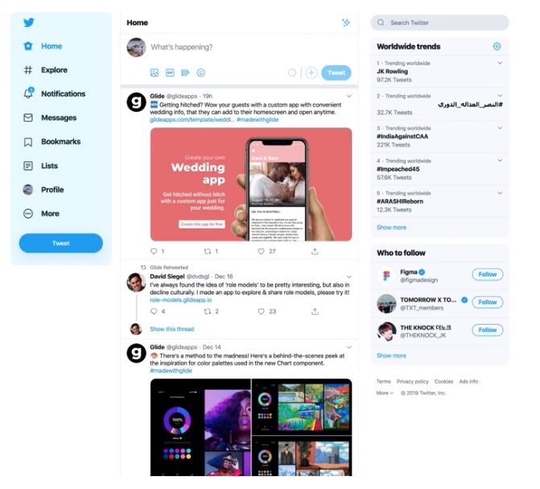
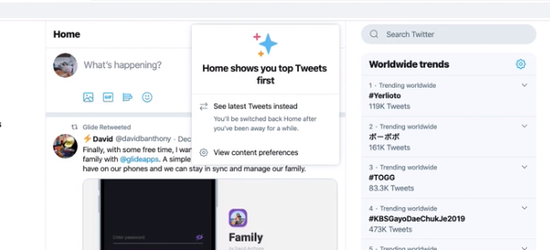
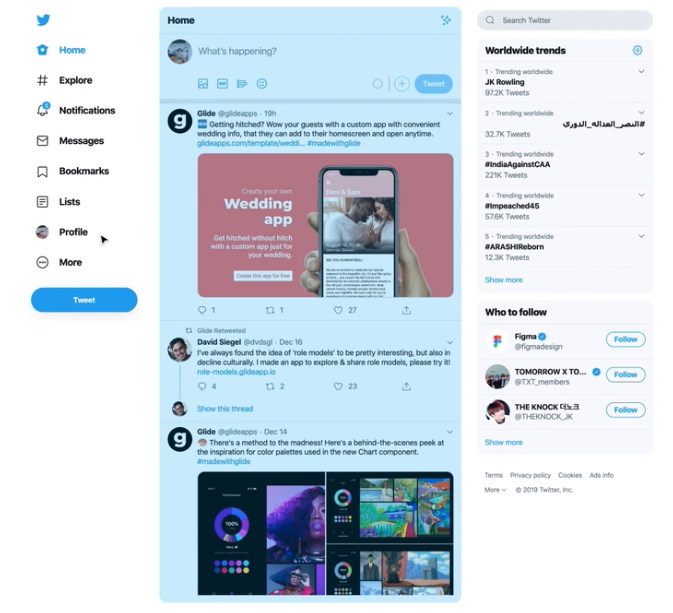
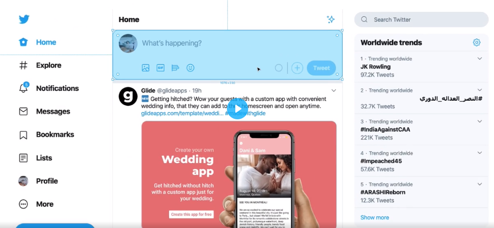
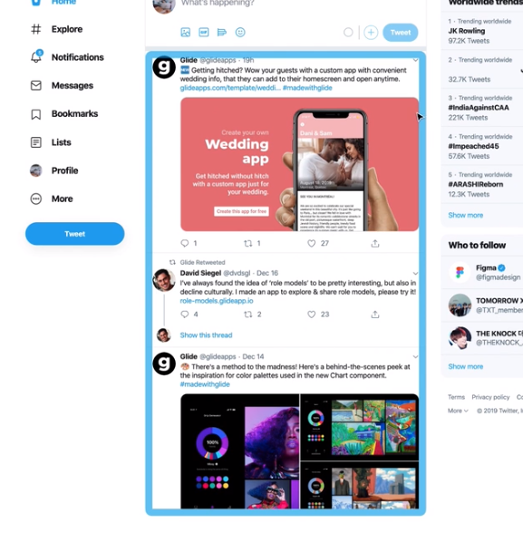
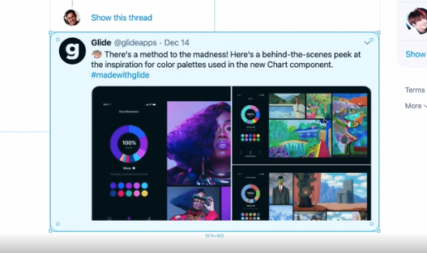
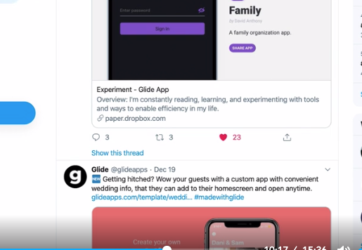
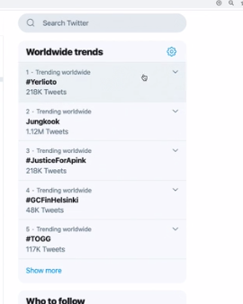

### [문제 01-01] 다음을 마크업 하여라.



- 01-header.html

```html
<header>
  <h1>
    <a href=""></a>
  </h1>
</header>
```

- 02-global-navitaion.html

```html
<nav>
  <h1>Global Navigation Menu</h1>
  <ul>
    <li>
      <a href="#">
        <span>Current page</span>
        <!-- Icon -->
        Home
      </a>
    </li>
    <li>
      <a href="#">
        <!-- Icon -->
        Explore
      </a>
    </li>
    <li>
      <a href="#">
        <strong aria-label="5 Unread notifications">5</strong>
        <!-- Icon -->
        Notifications
      </a>
    </li>
    <li>
      <a href="#">
        <!-- Icon -->
        Messages
      </a>
    </li>
    <li>
      <a href="#">
        <!-- Icon -->
        Bookmarks
      </a>
    </li>
    <li>
      <a href="#">
        <!-- Icon -->
        Lists
      </a>
    </li>
    <li>
      <a href="#">
        <!-- Icon -->
        Profile
      </a>
    </li>
    <li>
      <button type="button">
        <!-- Icon -->
        More
      </button>
      <!-- DROPDOWN MENU -->
    </li>
  </ul>
  <button type="button">
    Tweet
  </button>
</nav>
```

### [문제 01-02] 다음을 마크업 하여라. 메인




```html
<main>
  <header>
    <h1>Home</h1>
    <button type="button" aria-label="Timeline options"><!-- Icon--></button>
    <div>
      <h2>Home shows you top Tweets first</h2>
      <!-- Icon-->
      <button type="button">
        <strong>See latest Tweets instead</strong>
      </button>
      <span
        >You'll be switched back Home after you've been away for a while.</span
      >
      <a href="#">
        <!-- Icon-->
        View content preferences
      </a>
    </div>
  </header>
</main>
```

### [문제 01-03] 다음을 마크업 하여라. 트위트 폼



```html
<section>
  <h1>What's happening?</h1>
  <form action="#" method="POST">
    
    <texarea placeholder="What's happeing?" maxlength="280"></texarea>
    <button type="button" aria-label="Upload files">
      <!-- Icon -->
    </button>
    <input type="file" multiple accept="image/*, video/*" />

    <button type="button" aria-label="Search GIFS...">
      <!-- Icon -->
    </button>
    <button type="button" aria-label="Create a poll">
      <!-- Icon -->
    </button>
    <button type="button" aria-label="Choose emoji">
      <!-- Icon -->
    </button>
    <strong aria-label="0 out of 280 characters"></strong>
    <button type="button" aria-label="Add another tweet">
      <!-- Icon -->
    </button>

    <button type="submit">Tweet</button>
  </form>
</section>
```

### [문제 01-04] 다음을 마크업 하여라. 타임라인



```html
<section>
  <h1>Your Timeline</h1>
  <ol>
    <li>
      <!-- Tweet -->
    </li>
    <li>
      <!-- Tweet -->
    </li>
    <li>
      <!-- Tweet -->
    </li>
    <li>
      <!-- Tweet -->
    </li>
    <li>
      <!-- Tweet -->
    </li>
  </ol>
</section>
```

### [문제 01-05] 다음을 마크업 하여라.아티클




```html
<articla>
  <h1>A Tweet from 김익명</h1>
  <header>
    <a href="#"></a>
    <h2>
      <a href="#">
        김익명
      </a>
    </h2>
    <dl>
      <div>
        <dt>
          Username
        </dt>
        <dd><a href="#">@anonymouskim</a></dd>
      </div>
      <div>
        <dt>Posted</dt>
        <dd><a href="#">Dec 25</a></dd>
      </div>
    </dl>
    <button type="button" aria-abel="Options">
      <!-- Icon -->
    </button>
    <div>
      <button type="button">
        <!-- Icon -->
        Show less often
      </button>
      <button type="button">
        <!-- Icon -->
        Embed Tweet
      </button>
      <button type="button">
        <!-- Icon -->
        Unfollow @anonymouskim
      </button>
      <button type="button">
        <!-- Icon -->
        Mute @anonymouskim
      </button>
      <button type="button">
        <!-- Icon -->
        Block @anonymouskim
      </button>
      <button type="button">
        <!-- Icon -->
        Report Tweet
      </button>
    </div>
  </header>
  <p>
    영어를 더 잘 하고싶다. 그러나 공부를 하고 싶지는 않다. 내 삶의 모든 것이
    이런 식으로 망해왔다
  </p>
  <footer>
    <button tupe="button">
      <span class="sr-only">Tweet your replay</span>
      <strong aria-label="3 replied">3</strong>
    </button>
    <footer>
      <button tupe="button">
        <span class="sr-only">Retweet</span>
        <strong aria-label="3 retweeted">3</strong>
      </button>
      <div>
        <button type="button">Retweet</button>
        <button type="button">Retweet with comment</button>
      </div>
      <button type="button">
        <span class="sr-only">Like this tweet</span>
        <strong aria-label="100 liked">100</strong>
      </button>
      <button type="button">
        <span class="sr-only">Share</span>
      </button>
      <div>
        <button type="button">Send via Direct Message</button>
        <button type="button">Add Tweet to Bookmarks</button>
        <button type="button">Copy link to Tweet</button>
      </div>
  </footer>
</article>

```

### [문제 01-06] 다음을 마크업 하여라. 어사이드



```html
<!--
  섹션: 논리적으로 완결된 하나의 집합체
  아티클: 기사, 트위트, 블로그, 뉴스 등
  어사이드: 본문내용과 직접적으로 연관이 없는 동떨어진 분리된 내용 마크업할때 사용
  사이드바쪽에 있다던가 , 배너광고, 작은위젯 같은것을 마크업을할때 사용하는 태그
  어사이드 태그도 섹셔닝 엘리먼트이기 때문에 반드시 헤딩 태그를 사용해야 한다.
-->
<aside>
  <header>
    <h1>Worldwide trends</h1>
    <button type="button" aria-label="Options">
      <!-- Icon -->
    </button>
  </header>
  <ol>
    <li>
      <button type="button" aria-label="Options" />
      <!-- Icon -->
      <div>
        <button type="button">
          <!-- Icon -->
          This trend is spam
        </button>
      </div>
      <a href="#">
        <span>1 · Trending worldwide</span>
        <strong lang="ko">#김버그</strong>
        <span>100K Tweets</span>
      </a>
    </li>
    <li>
      <button type="button" aria-label="Options" />
      <!-- Icon -->
      <div>
        <button type="button">
          <!-- Icon -->
          This trend is spam
        </button>
      </div>
      <a href="#">
        <span>2 · Trending worldwide</span>
        <strong lang="ko">#김버그</strong>
        <span>100K Tweets</span>
      </a>
    </li>
    <li>
      <button type="button" aria-label="Options" />
      <!-- Icon -->
      <div>
        <button type="button">
          <!-- Icon -->
          This trend is spam
        </button>
      </div>
      <a href="#">
        <span>3 · Trending worldwide</span>
        <strong lang="ko">#김버그</strong>
        <span>100K Tweets</span>
      </a>
    </li>
    <li>
      <button type="button" aria-label="Options" />
      <!-- Icon -->
      <div>
        <button type="button">
          <!-- Icon -->
          This trend is spam
        </button>
      </div>
      <a href="#">
        <span>4 · Trending worldwide</span>
        <strong lang="ko">#김버그</strong>
        <span>100K Tweets</span>
      </a>
    </li>
    <li>
      <button type="button" aria-label="Options" />
      <!-- Icon -->
      <div>
        <button type="button">
          <!-- Icon -->
          This trend is spam
        </button>
      </div>
      <a href="#">
        <span>5 · Trending worldwide</span>
        <strong lang="ko">#김버그</strong>
        <span>100K Tweets</span>
      </a>
    </li>
  </ol>
  <footer>
    <button typue="button">Show more</button>
  </footer>
</aside>
```

### [문제 01-07] 다음을 마크업 하여라.


```html
<footer>
  <a href="#" target="_blank">Terms</a>
  <a href="#" target="_blank">Privacy policy</a>
  <a href="#" target="_blank">Cookies</a>
  <a href="#" target="_blank">Ads info</a>
  <button type="button">
    More
    <!-- Icon-->
  </button>
  <div>
    <a href="#" target="_blacnk">About</a>
    <a href="#" target="_blacnk">Status</a>
    <a href="#" target="_blacnk">Businesses</a>
    <a href="#" target="_blacnk">Developers</a>
  </div>
  <span>© 2019 Twitter, Inc.</span>
</footer>
```
