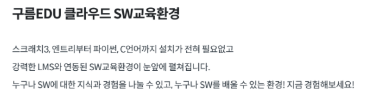
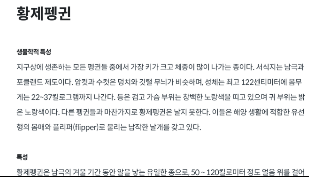
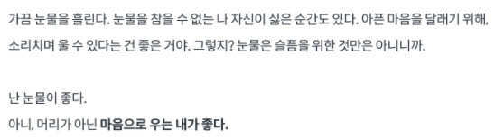
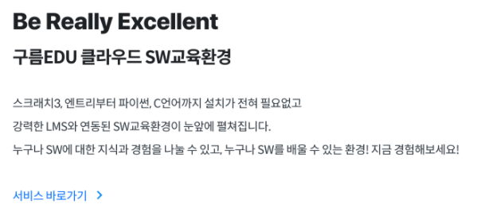
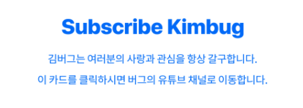
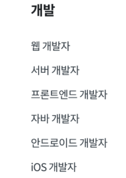
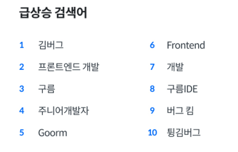
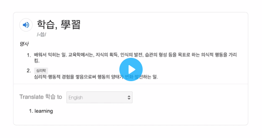
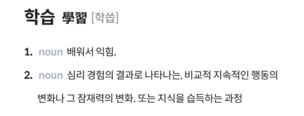

### [문제 01-01] 다음을 마크업 하여라.



```HTML
<h1>구름EDU 클라우드 SW교육환경</h1>
<p>
스크래치3, 엔트리부터 파이썬, C언어까지 설치가 전혀 필요 없고<br />
강력한 LMS와 연동된 SW교육환경이 눈앞에 펼쳐집니다.<br />
누구나 SW에 대한 지식과 경험을 나눌 수 있고, 누구나 SW를 배울 수 있는 환경! 지금 경험해보세요!
</p>

```

### [문제 01-02] 다음을 마크업 하여라.



```HTML
<h1>황제펭귄</h1>
<h2>생물학적 특성</h2>
<p>지구상에 생존하는 모든 펭귄들 중에서 가장 키가 크고 체중이 많이 나가는 종이다. 서식지는 남극과
  포클랜드 제도이다.
<p>
<h2>특성</h2>
<p>황제펭귄은 남극의 겨울기간 동안</p>
```

### [문제 01-03] 다음을 마크업 하여라.



```HTML
<p>
  가끔 눈물을 흘린다. 눈물을 참을 수 없는 나 자신이 싫은 순간도 있다. 아픈 마음을 달래기 위해,
  소리치며 울 수 있다는 건 좋은 거야. 그렇지? 눈물은 슬픔을 위한 것만은 아니니까.<br />
  <br />
  <br />
  난 눈물이 좋다.<br />
  아니, 머리가 아닌 <strong>마음으로 우는 내가 좋다.</strong>
</p>
```

### [문제 01-04] 다음을 마크업 하여라.



```HTML
<strong>Be Really Excellent<strong>
<h1>구름EDU 클라우드 SW교육환경</h1>
<h3>스크래치3, 엔트리부터 파이썬, C언어까지 설치가 전혀 필요없고<br/>
강력한 LMS와 연동된 SW교육환경이 눈앞에 펼쳐집니다.
누구나 SW에 대한 지식과 경험을 나눌 수 있고, 누구나 SW를 배울 수 있는 환경! 지금 경험해 보세요!
</h3>
<a href="#">서비스 바로가비</a>
```

### [문제 01-05] 다음을 마크업 하여라.



```HTML
<a href="#">
  <h1>Subscribe Kimbug</h1>
  <p>김버그는 여러분의 사랑과 관심을 항상 갈구 합니다.<br/>
  이 카드를 클릭하시면 버그의 유튜브 태널로 이동 합니다.
  </p>
</a>

```

### [문제 01-06] a태그의 여러가지 사용방법

```HTML
tel: mailto:
```

### [문제 01-07] 다음을 마크업 하여라.


```HTML

```

### [문제 01-08] 다음을 마크업 하여라.


```HTML

```

이럴필요까지 없는거 안다. 재미로 해봤다.

### [문제 01-09] 다음을 마크업 하여라.



```HTML
<h1>개발</h1>
<ul>
  <li>웹 개발자</li>
  <li>서버 개발자</li>
  <li>프론트엔드 개발자</li>
  <li>자바 개발자</li>
  <li>안드로이드 개발자</li>
  <li>iOS 개발자</li>
</ul>

```

### [문제 01-10] 다음을 마크업 하여라.



```HTML
<h1>급상승 검색어</h1>
<ol>
  <li><a href="#">김버그</a></li>
  <li><a href="#">프론트엔드 개발</a></li>
  <li><a href="#">구름</a></li>
  <li><a href="#">주니어개발자</a></li>
  <li><a href="#">Goorm</a></li>
  <li><a href="#">Frontend</a></li>
  <li><a href="#">개발</a></li>
  <li><a href="#">구름IDE</a></li>
  <li><a href="#">버그킴</a></li>
  <li><a href="#">튕김버그</a></li>
</ol>

```

### [문제 01-11] 다음을 마크업 하여라.



```HTML
<dl>
<dl>

```

### [문제 01-12] 다음을 마크업 하여라.



```HTML

```
